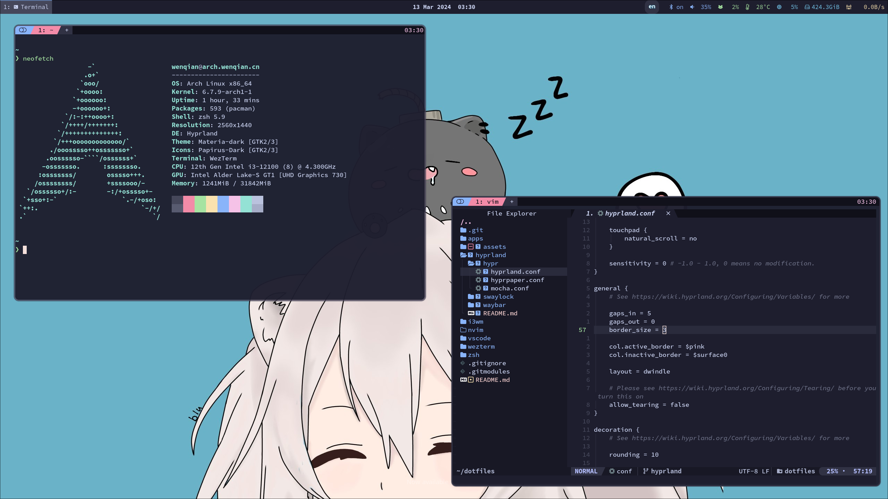

# dotfiles



Powered by:

- OS: [Arch Linux](https://archlinux.org/)
- WM: [Sway](https://swaywm.org/)
- Terminal: [WezTerm](https://wezfurlong.org/wezterm/index.html)
- Editor: [Neovim](https://neovim.io/)
- Theme: [Catppuccin](https://github.com/catppuccin/catppuccin)

## Arch Linux

<details>
<summary>Install Arch Linux in archiso</summary>

In archiso:

```bash
# Donot let reflector auto change our pacman mirrors.
systemctl stop reflector.service

# Ensure that we are in UEFI mode.
ls /sys/firmware/efi/efivars

# Connect wifi (optional)
iwctl # connect wifi

# Make sure that archiso has connected to Internet.
curl http://baidu.com

# Update the system clock
timedatectl set-ntp true
timedatectl status

# Change the mirrors to China.
vim /etc/pacman.d/mirrorlist

# Confirm disk and do the partition.
lsblk
cfdisk /dev/xxx

# Format our new partitions.
mkfs.vfat -F32 /dev/xxx1
mkswap /dev/xxx2
mkfs.ext4 /dev/xxx3

# Mount all the partitions.
mount /dev/xxx3 /mnt
mkdir /mnt/boot
mount /dev/xxx1 /mnt/boot
swapon /dev/xxx2
df -h
free -h

# Install archlinux
pacstrap /mnt base base-devel linux linux-firmware
pacstrap /mnt networkmanager vim sudo zsh zsh-completions

# Generate fstab
genfstab -U /mnt > /mnt/etc/fstab
cat /mnt/etc/fstab

# Switch to the new system
arch-chroot /mnt

# Edit the hostname
vim /etc/hostname

# Edit localhost DNS
# Set to this: (`myarch` is your hostname)
# 127.0.0.1   localhost
# ::1         localhost
# 127.0.1.1   myarch.localdomain myarch
vim /etc/hosts

# Set time zone.
ln -sf /usr/share/zoneinfo/Asia/Shanghai /etc/localtime

# Sync time to hardware.
hwclock --systohc

# Config locale, uncomment `en_US.UTF-8 UTF-8`.
vim /etc/locale.gen

# Setup locale.
locale-gen
echo 'LANG=en_US.UTF-8'  > /etc/locale.conf

# Set password for root
passwd root

# The ucode
pacman -S intel-ucode
# AMD: pacman -S amd-ucode

# Install and config Grub
pacman -S grub efibootmgr os-prober
grub-install --target=x86_64-efi --efi-directory=/boot --bootloader-id=ARCH
# Edit grub config `GRUB_CMDLINE_LINUX_DEFAULT`:
# - Remove `-quiet`.
# - Set `loglevel` to `5`.
# - Add `nowatchdog`.
vim /etc/default/grub
grub-mkconfig -o /boot/grub/grub.cfg

# Exit archiso and restart, enter the new system
exit
umount -R /mnt
reboot
```

</details>

<details>
<summary>Initialize a new Arch Linux</summary>

In new system:

```bash
# Enable network
systemctl enable --now NetworkManager

# Config network
nmtui

# neofetch time :)
pacman -S neofetch
neofetch

# Add multilib and archlinuxcn:
#
# [multilib]
# Include = /etc/pacman.d/mirrorlist
#
# [archlinuxcn]
# Server = https://mirrors.ustc.edu.cn/archlinuxcn/$arch
# Server = https://mirrors.tuna.tsinghua.edu.cn/archlinuxcn/$arch
vim /etc/pacman.conf

# Flush pacman
pacman -Syyu

# The normal user
useradd -m -G wheel -s /bin/bash wenqian
passwd wenqian
# Uncomment: %wheel ALL=(ALL:ALL) ALL
EDITOR=vim visudo

# Use new user to login.
logout

# Init archlinuxcn and install yay
sudo pacman-key --lsign-key "farseerfc@archlinux.org"
sudo pacman -S archlinuxcn-keyring
sudo pacman -S yay

# Some basic softwares
sudo pacman -S wezterm
sudo pacman -S thunar
sudo pacman -S nm-connection-editor
yay -S google-chrome
sudo pacman -S neovim
sudo pacman -S sof-firmware alsa-firmware alsa-ucm-conf
sudo pacman -S ttf-sourcecodepro-nerd adobe-source-han-serif-cn-fonts wqy-zenhei
sudo pacman -S noto-fonts noto-fonts-cjk noto-fonts-emoji noto-fonts-extra
sudo pacman -S pulseaudio sof-firmware alsa-firmware alsa-ucm-conf pavucontrol # Audio
sudo pacman -S bluez bluez-utils blueman # Bluetooth

# Enable bluetooth (optional)
sudo systemctl enable --now bluetooth

# Install Intel GPU driver (for others, please refer to offical document):
sudo pacman -S mesa lib32-mesa vulkan-intel lib32-vulkan-intel

# Chinese Input Method
sudo pacman -S fcitx5-im
sudo pacman -S fcitx5-chinese-addons
sudo pacman -S fcitx5-material-color

# Add:
# GTK_IM_MODULE=fcitx
# QT_IM_MODULE=fcitx
# XMODIFIERS=@im=fcitx
# SDL_IM_MODULE=fcitx
# GLFW_IM_MODULE=ibus
sudo vim /etc/environment

# FUCK GFW:
sudo pacman -S v2ray v2raya
sudo systemctl enable --now v2raya

# Some common softwares for wms:
sudo pacman -S sddm
sudo systemctl enable sddm
sudo pacman -S rofi
```

</details>

WMs:

I use [Tiling Window Manager](https://en.wikipedia.org/wiki/Tiling_window_manager):

- [Sway (Wayland)](https://swaywm.org/): [My config](sway)
- [i3wm (X11)](https://i3wm.org/): [My config](i3wm)

The sway has a much better performance, but some softwares might not work (like [flameshot](https://flameshot.org/)).

Some other popular tiling WMs:

- [Hyprland (Wayland)](https://hyprland.org/)
- [Awesome (X11)](https://awesomewm.org/)
- [bspwm (X11)](https://github.com/baskerville/bspwm)
- [dwm (X11)](https://dwm.suckless.org/)

> TIPs:
>
> - If you use NVIDIA GPU, please use `X11`.
> - If you want to use some [wine](https://www.winehq.org/) apps, like WeChat, please use `X11`.
> - In other cases, please use `Wayland`.

If you donot like tiling WMs, you can also install [KDE Plasma](https://kde.org/plasma-desktop/):

```bash
sudo pacman -S plasma-meta konsole dolphin
sudo systemctl start sddm
```

## Development

Powered by:

- [oh my zsh](https://ohmyz.sh/)
- [Spacenvim (my own neovim config)](https://github.com/fioncat/spacenvim)
- [roxide (my own git repository manager)](https://github.com/fioncat/roxide)

Build my development environment:

<details>
<summary>Zsh</summary>

Install [oh my zsh](https://ohmyz.sh/) and some zsh plugins:

```bash
sh -c "$(curl -fsSL https://raw.githubusercontent.com/ohmyzsh/ohmyzsh/master/tools/install.sh)"

# Plugins
git clone https://github.com/zsh-users/zsh-autosuggestions ${ZSH_CUSTOM:-~/.oh-my-zsh/custom}/plugins/zsh-autosuggestions
git clone https://github.com/zsh-users/zsh-syntax-highlighting.git ${ZSH_CUSTOM:-~/.oh-my-zsh/custom}/plugins/zsh-syntax-highlighting
```

</details>

<details>
<summary>Packages</summary>

Install some terminal packages:

```bash
sudo pacman -S fzf starship

# Required for neovim
sudo pacman -S sqlite3 ripgrep xclip zip unzip npm nodejs

# Tools
sudo pacman -S bottom duf exa dust procs

# Code - OSS
sudo pacman -S code
```

</details>

<details>
<summary>Neovim</summary>

Install neovim config:

```bash
bash -c "$(curl -fsSL https://raw.githubusercontent.com/fioncat/spacenvim/HEAD/scripts/install.sh)"
```

</details>

<details>
<summary>Rust</summary>

Install Rust:

```bash
sudo pacman -S rustup
rustup toolchain install stable
rustup component add clippy
rustup component add rust-analyzer
rustup component add rust-src
```

</details>

<details>
<summary>Go</summary>

Install Go:

```bash
sudo pacman -S go

# Some go tools
go install github.com/klauspost/asmfmt/cmd/asmfmt@latest
go install github.com/go-delve/delve/cmd/dlv@latest
go install github.com/kisielk/errcheck@latest
go install github.com/davidrjenni/reftools/cmd/fillstruct@latest
go install github.com/rogpeppe/godef@latest
go install golang.org/x/tools/cmd/goimports@latest
go install golang.org/x/lint/golint@latest
go install github.com/golangci/golangci-lint/cmd/golangci-lint@latest
go install github.com/fatih/gomodifytags@latest
go install golang.org/x/tools/cmd/gorename@latest
go install github.com/jstemmer/gotags@latest
go install golang.org/x/tools/cmd/guru@latest
go install github.com/josharian/impl@latest
go install honnef.co/go/tools/cmd/keyify@latest
go install github.com/fatih/motion@latest
go install github.com/koron/iferr@latest
```

</details>

<details>
<summary>Roxide</summary>

Build and install roxide:

```bash
cargo install --git https://github.com/fioncat/roxide
```

</details>

For other applications, please refer to [apps](apps).
