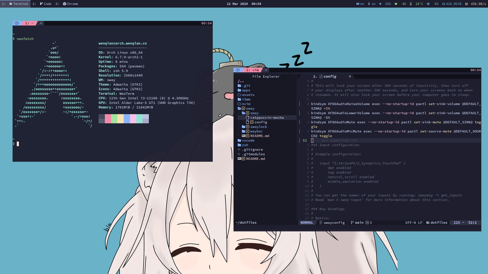

# dotfiles

Powered by:

- OS: [Arch Linux](https://archlinux.org/)
- WM: [Hyprland](https://hyprland.org/)
- Terminal: [WezTerm](https://wezfurlong.org/wezterm/index.html)
- Editor: [Neovim](https://neovim.io/)
- Theme: [Catppuccin](https://github.com/catppuccin/catppuccin)

Setup:

1. [Install Arch Linux Guide](https://arch.icekylin.online/)
2. Ensure your network is available: `sudo systemctl enable --now NetworkManager`
3. Install git: `sudo pacman -S git`
4. Clone this repository to home directory: `git clone https://github.com/fioncat/dotfiles.git ~/dotfiles`
5. Run bootstrap script: `~/dotfiles/scripts/bootstrap.sh`
6. Install graphic driver, see: [Arch Linux Graphic Driver](https://arch.icekylin.online/guide/rookie/graphic-driver.html)
7. Reboot your system to enter Hyprland
8. Run proxy script and config it (if your are in GWF): `~/dotfiles/scripts/proxy.sh`
9. Run dev script to init your development environment: `~/dotfiles/scripts/dev.sh`

Inspired by [end-4/dots-hyprland](https://github.com/end-4/dots-hyprland).

Hyprland official wallpapers: [Wallpaper contest winners](https://hyprland.org/news/contestWinners/).
